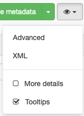
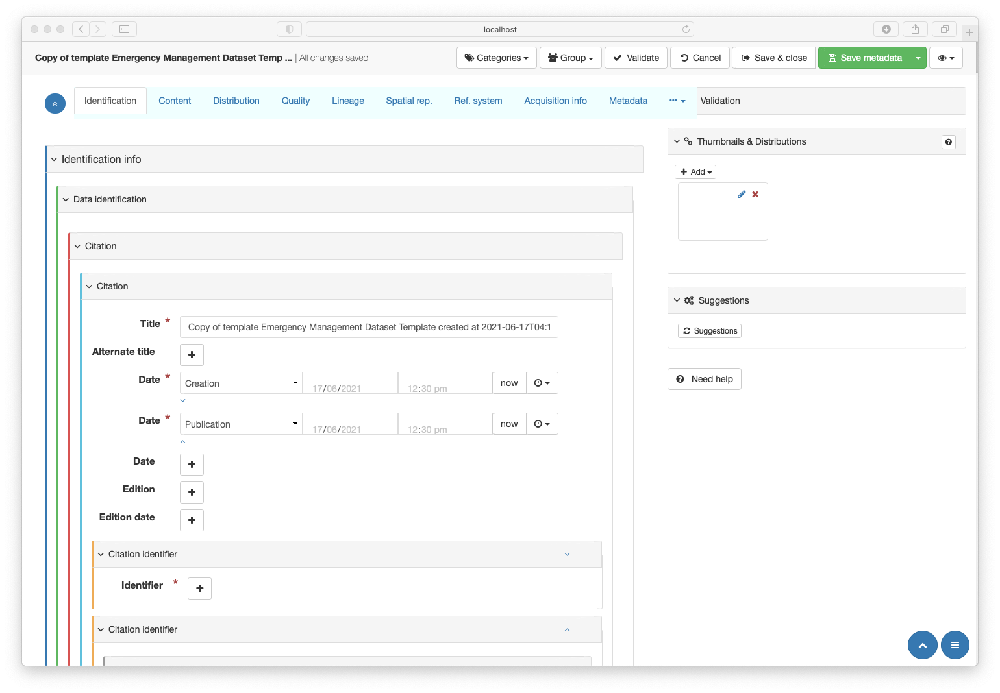
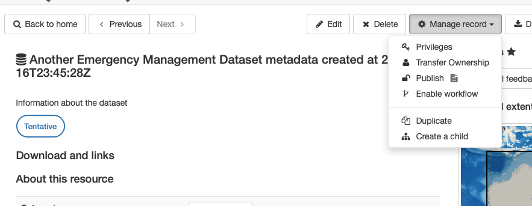
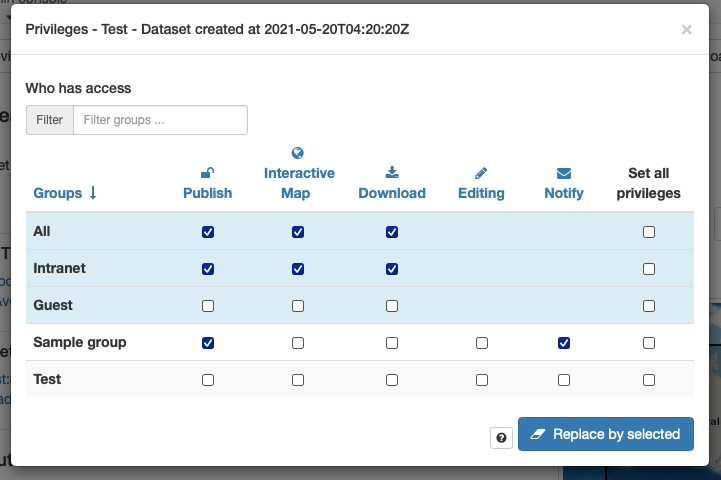
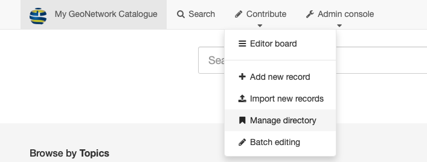
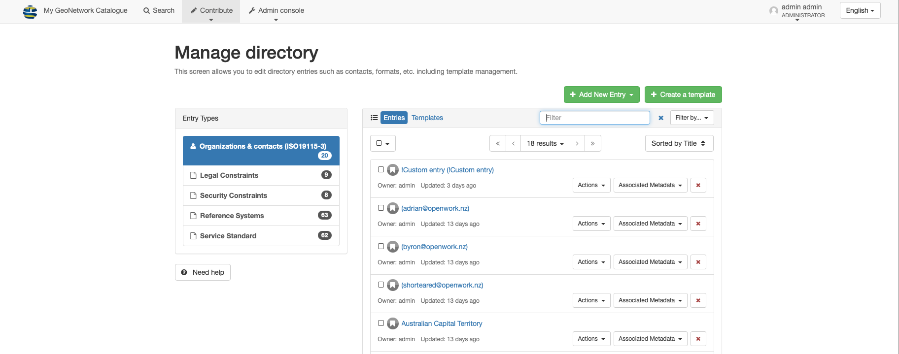
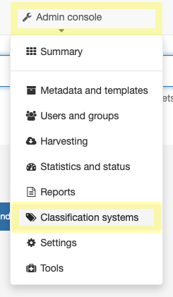

# ANZLIC Metadata Toool Admin Guide

Intro - 
This document covers issues that are beyond the role of a basic metadata editor. These include:
* **Advanced Editing** functionality
* **Publishing** and review of completed metadata records
* **System Managemnet** tasks.

## Advanced Editing of Metadata

### _Advanced_ Editor interface
At several points in the User Guide, the editor is instructed to contact their administrator to advise on use of the "Advanced" editor interface.  

>NOTE: The **Advanced** editor is structurally identical to the GeoNetwork **Full** save for minor changes to a few widgets. 

### More _View Selector_ options
The other _View selector_ options work as described in [GeoNetwork Documentation](https://geonetwork-opensource.org/manuals/trunk/en/user-guide/describing-information/editing-metadata.html?highlight=editor#navigating-the-form)

* **XML** enables a raw xml view of the metadata identical to standard GeoNetwork implementations.
* Enabling **More details** using the checkbox in the _View selector_ dropdown is not recommended for non-advanced users. This option may be useful to advanced editors.
* **Tooltips** should be enabled in all editors to provide easy inline mouse-over access to these help files.
* When editing in an view other than **ANZLIC**,  a line, _ANZLIC_ will now appear in the _View selector_ as an option.

## Publishing Metadata

While the **ANZLIC Metadata tool** does not mandate metadata workflows, it is recommend that a _Reviewer_ role be implemented.

Best practice is that metadata editors do not publish their own metadata. Metadata should be reviewed and published by someone with the role of _Reviewer_ or higher.  ENSEMA has committed to implementing this pattern. 

A Reviewer can publish a metadata record by viewing that record and selecting the **Publish** in the **View** top tool bar.

Futher refinement of permissions can be managed by select the **Privileges** option on the same menu to launch this dialogue:

Enabling GeoNetwork workflows may help with the management of this process.

GeoNetwork provides guidance on implementing [Life cycle workflow here](https://geonetwork-opensource.org/manuals/trunk/en/user-guide/workflow/life-cycle.html).

## System Management
Standard administrative task of note include the management of **Users and Groups** and **Template** metadata records.
Additional specific **ANZLIC Metadata tool** management task include the management of specilised subdirectories and Thesauri. 

### Managed Directories

**Managed directories** hold categories of metadata fragment entries. These are used to ease the population on metadata records through special interfaces. Some additional adminstrative management of these special resources is necessary. This interface can be accessed via the **Manage directory** option under the **Contribute** menu available in the top toolbar on the main screen. .

The launches the **Manage directory** window .

GeoNetwork opensource provides guidance on the use of [**Managed directories here](https://geonetwork-opensource.org/manuals/trunk/en/administrator-guide/managing-classification-systems/managing-directories.html?highlight=managed%20directories#managing-directories)

The **ANZLIC Metadata tool** includes several of these **Managed directories**:

* **Legal Constraints** - Contains a delimited list of constraints of a legal nature. 
    * A selection of the most common open licences is provided with the **ANZLIC Metadata tool** distribution.
    * Administrators may need to extend and modify this list as they see fit. 

* **Security Constraints** - Contains a delimited list of security constraints. 
  * Souced from _Australian Government Security Classification System Nov 2018_. 
  * Administrators may need to extend and modify this list as they see fit. 
	
* **Reference Systems** - Provides a list of common Spatial Reference Systems used in Australia
  * Populates _Reference System Type_ as well as all other needed SRS fields
  * Administrators may need to extend and modify this list as they see fit. 
  
* **Organisations & Contacts (ISO19115-3)** - Provides prepopulated citation metadata by which all contact metadata is populated
  * One entry, _!Custom entry_ is provided with distribution to allow manual population of field via the table interface
  * Administrators **Must** add contacts information to this table for it to be available o editors.
  * A method by which editors can notify administrators that a contact needs to be added or corrected is recommended.

### Thesaurus Management
The prorovided EMA template metadata records, which provide the framework for all EMA metadata, rely on certain thesauri being avalible to populate Keywords metadata.

General guidance for managing thesuri can be found at this [GeoNetwork help page](https://geonetwork-opensource.org/manuals/3.10.x/en/administrator-guide/managing-classification-systems/managing-thesaurus.html).

Administrators can access the thesaurus management tools by selecting **Classification systems** from the **Admin console** menu availble from the  top toolbar on the main screen. .

At the completion of the instalation following the provided instructions, there are five thesauri loaded to support the  **ANZLIC Metadata tool**. These include

For **Dataset** and **Service** metadata these include:
* **Hazard type** - Contains a list of common emergency management hazard types
* **Process type** - _For dataset metadata only_ - Four options _Modelled, Observed, Modelled and Observed, and other_
* **CAP-AU Compliance** - Keywords that capture the nature of CAP compliance of the resource, _CAP-AU Compliant, CAP-AU incompliant, and CAP-AU unknown_
For **Service** metadata additional keywords include:
* **ISO19119 Service Type** - Provides a enumeration of values of which at least one **Must** populatea service metadata
* **Protocol Type** - Suggested list of keywords for the software, platform and/or standard describing the service.

### Users, Groups and Profiles
Geonetwork user management implies some highly recommened workflow rules. It is the administrators task to manage these. Instructions to do so can be found in the [GeoNetwork help pages here](https://geonetwork-opensource.org/manuals/3.10.x/en/administrator-guide/managing-users-and-groups/index.html).

Configuring GeoNework to use enteprise authentication tools such as LDAP can be acoomplished using the instructions found [here](https://geonetwork-opensource.org/manuals/3.10.x/en/administrator-guide/managing-users-and-groups/authentication-mode.html?highlight=authentication#authentication-mode).

### Template Management

Templates metadata support included in GeoNetwork. Most metadata is very similar to existing metadata records save for a relatively small number of fields. GeoNetwork leverages this fact by providing a flexible system of templates to provide a powerful tool to ease the creation of metadata. Two template records are provided with the EMA version of the **ANZLIC Metadata tool**:
* **Emergency Management Dataset Template** - for the creation of basic EMA dataset metadata and
* **Emergency Management Service Template** - for the creation of basic EMA geospation service metadata.

Administrators may find it useful to create more refined versions of these templates to ease the creation of metadata for specific common resources. As comfort in the use of the tool increases, the desire to do so may increase. Editors too can create new template variations, but like metadata, these need to go through a publishing process to be accessible by a wide number of users.

As the number of templates grows, the management of these templates may become a significant task. Too many templates may confuse new users (and old) as to which template they should use. Outdated and otherwise useless templates should be removed by administrtors. For more instructions on template manaement see this [GeoNetwork help page](https://geonetwork-opensource.org/manuals/3.10.x/en/user-guide/describing-information/managing-templates.html?highlight=templates#managing-templates.)
