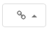
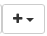
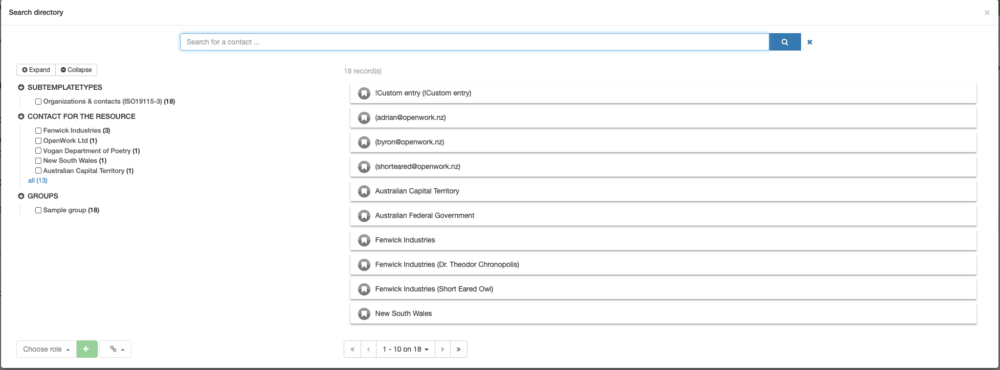
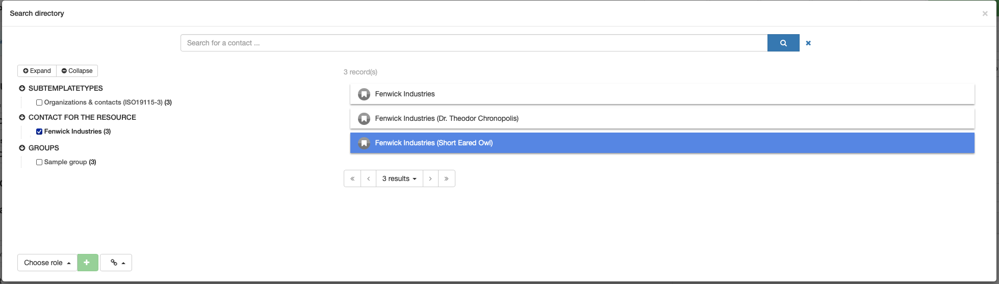

# Contacts

This tab is used to capture:
* **Resource Contacts** - Information about parties that have some responsibility to the resource described in the metadata.
* **Metadata Contacts** - Information about parties that have some responsibility to the metadata record describing the resource.

## Using the _Search for contact_ tool 
This tool allows contacts to be selected from a list maintained by your administrator. This improves consistency, searchability, correctness and eases population of responsible party information.

This tool can be used in two ways -
1. Simple search
    * In the "Search for contact" field, type the first few letters of the desired party.
    * To the right of the desired entry select the appropriate role for the party by clicking either the  or  . 
    * A new entry will appear in the table.
    
1. Advanced search
    * To the left of the "Search for contact" field, click the spyglass icon  to display the advanced search interface. 
    > NOTE: Do not use the   icon. A bug in GeoNetwork requires its presence while not allowing it to function properly. If a row to the table is added with this method, only the _Role_ element will present. As usual, this row can be removed by clicking the red "X" to the right of the row.
    * **Narrowing your search -** Searches can be narrowed in two ways
        * Using the "Search for contact" field, at the top of the popup as you would in Simple search
        * Using the _Facets_ in the left sidebar, select the category appropriate to the party 
    * Select the desired contact from the results
    * Two ways to populate the metadata record with the chosen contact
        1. Select the appropriate role for your chosen contact by clicking on the "Choose role" button in the lower left of the window and click the  icon.
        1. Click the spyglass icon , also in the lower left, and select a role from the dropdown menu
    * A new entry will appear in the table.

**When the party is not found**
If a party is not available via search, do the following:
* Following the _Simple search_ guidance above, type a "!" in the "Search for contact" box
* Select "!Custom entry". 
* Overwrite the provided fields with appropriate contact information. 
   * Remember to select the appropriate role from the dropdown
* If the contact is likely to be used again for other metadata, contact your administrator to add entry for this party to the *Contacts* managed directory.

> NOTE: Your administrator will provide guidance about whether to use the either the  or  icon when adding contacts.

## Resource Contacts
### Point of Contact - _Contact information for those who provide a first point of contact related to the resource_ 
* **ICSM Guidance** - https://icsm-au.github.io/metadata-working-group/defs/ResourcePointOfContact
* **Custodian** and a **Owner** contact information **Must** be provided. Other points of contact may be added
    * Use the **Search for contact** tool guidance provided above

### Responsible party - _Name and position information for an individual or organisation that is responsible for the resource_
* **ICSM Guidance** - https://icsm-au.github.io/metadata-working-group/defs/ResourceResponsibleParty
* Additional contacts ay be provided for parties that hold particular roles related to the resource. Any number may be added.
    * Responsible party contacts may be the same as parties cited in _Point of contact_ or _Metadata Contacts_
    * Use the **Search for contact** tool guidance provided above

## Metadata Contacts
### Contact - _Contact information for those parties that hold responsibilities related to the metadata record and its maintenance_ 
>NOTE: Not to be used for resource contact information
* **ICSM Guidance** - https://icsm-au.github.io/metadata-working-group/defs/MetadataContact
* Using the **Search for contact** tool guidance provided above, populate this table as many times as needed (one entry is common). 
>NOTE: A bug in the GeoNetwork interface makes it necessary that a blank field be in the template. This appears in the table as a  "Point of contact" entry with "!Please remove" in as _Name_. After adding a valid contact to this table, remove this entry by clicking the red "X" that now will appear to the right on mouse over on this entry.      
