# Getting Started 

## Steps

### Step One - Sign in 
1. Sign in by clicking "Sign in" in the toolbar and entering your credentials. 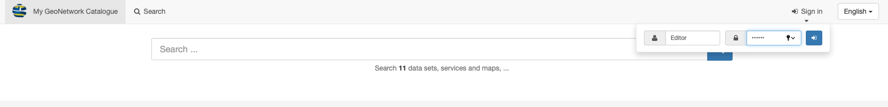
>NOTE: To edit metadata using the ANZLIC Metadata Tool, you will first need a user account with sufficient permission. If you do not have one, ask your administrator for help

### Step Two - Select a template
1. Under the **Contribute** option in the top toolbar and select **Add new record.** 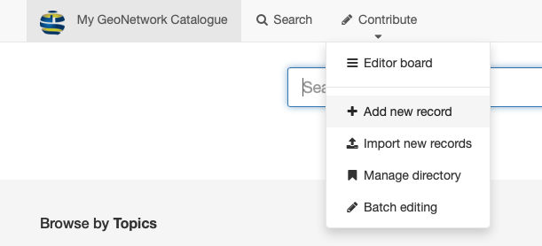
1. A new window will appear where you can find and select your starting template record. 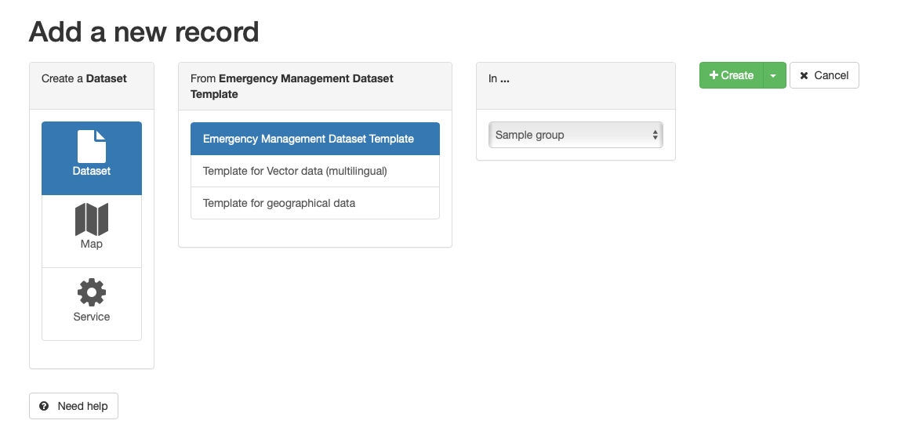
	1. Templates are stored by the types shown in the left hand column. **Dataset** templates will be shown by default.
	1. To select a template for **Service** metadata, select **Service** in the left had column
1. Select the desired template from the second column.
>NOTE: For default EMA installations, the **Emergency Management Dataset Template** should be used for dataset metadata. For service records, the **Emergency Management Service Template** should be used. Your administrator may see fit to provide variations of these templates for specific resource metadata.	
1. If you have membership in multiple groups, you can select the appropriate group for this metadata record in the third column.
1. Clinking the green **Create** button in the forth column will launch your new metadata record in the _ANZLIC Editor_ window.

### Step Three - Edit Metadata Record
Completion of **Step Two**  opens a new metadata record in the **ICSM** edit view.
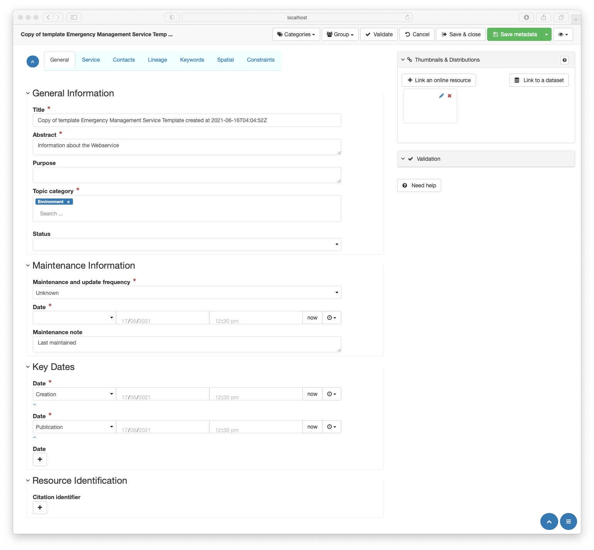
To start editing a metadata record, work through the tabs from left to right. Click on the tab name for further glance.
  1. [General](,/General-Metadata.html) - General information about the resource 
  1. [Service](./Service-Metadata.html) - Special metadata related to services. *Visible for service metadata only.*
  1. [Contacts](./Contacts-Metadata.html) - Information about relevant parties to the resource or metadata
  1. [ Linage](./Linage-Metadata.html) - Background and provenance information about the resource
  1. [Keywords](./Keyword-Metadata.html)- Specific search terms by which the resource may be discovered
  1. [Spatial](./Spatial-Metadata.html) - Includes metadata describing the resource location, reference systems used, and intended scale or resolution
  1. [Constraints](./Constraints-Metadata.html) - The legal, security and other restrictions that may apply to the resource
  
Editing of a metadata recocord is completed in the sidebar **Thumbnails & Distributions** panel.
See [Thumbnails & Distribution](./Thumbnails-and-Distributions-Metadata.html) for guidance.

### Step Four - Validate and Save 
1. Click **Save Metadata** in the editor top menu.
1. Click the **Validate** button
	1. This checks the metadata record using XSD and Schematron validation
	1. A set of suggestions to correct any errors appears 
Follow GeoNetwork guidance

### Step 4a - Assign Category (Optional)
1. Click the **Categories** button in the editor top menu.
1. A list of of categories from which one _Should_ choose that broadly categorises the the resource. 
>NOTE: This is a GeoNetwork provided list that helps with the management of metadata records. The values are stored separately to the ISO19115-3 metadata record.

### Step 4b - Group (Optional)
1. If you wish to assign your metadata to a different group, click **Group** in the editor top menu.
>NOTE: You can only assign metadata to groups of which you are a member. Talk with your administraor for more help.

### Step 5 - Save and close
* Record is not published 
* Notify your reviewer that the metadata is ready for review.
	* This process may be automated if GeoNetwork workflow tools are enabled 
* Your adminstrator or reviewer will do this

**Workflow**
To notify your reviewer that the metadata is ready for review and publishing, in the **Metadata view** for a selected record, select **Submit for review. 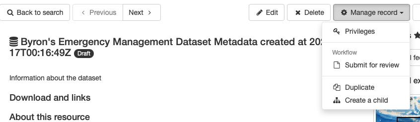

>NOTE: You may need first to **Enable workflow** by selecting that option under the same menu. 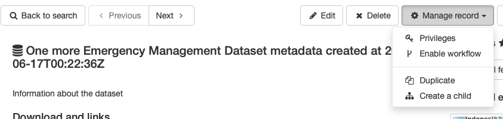

A interface appears where you can add details to your review request. 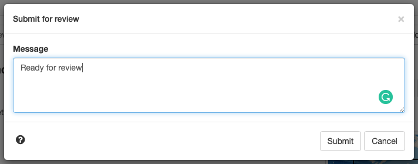]

The reviewers for your group will be notified that your metadata is ready to be reviewed and published.

## Getting Help
  This help document can be accessed in two ways:
  1. Select the **Need Help?* button at the bottom a side panel to open a directory of help pages in a new window,
  1. Clicking on most entry tools in the Editor interface will provide a brief statement about the usage of that entry and a **Help** link to more information.
    >NOTE: **Tooltips** must be enabled in the **View selector**for this behaviour.
    [**GeoNetwork help**](https://geonetwork-opensource.org/manuals/trunk/en/index.html) is available at https://geonetwork-opensource.org/manuals/trunk/en/index.html.
    [**ICSM Best Practice**](https://geonetwork-opensource.org/manuals/trunk/en/index.html) guide for ISO19115-3 metadata is available at https://geonetwork-opensource.org/manuals/trunk/en/index.html

# Navigating the Editing Window

The ANZLIC editing window can be desrcribed as habing four main components:
1. Top toolbar
1. Tabs
1. Body
1. Sidebar

The top toolbar buttons are to be used after metadata is complete. These include:
    1. Categories
    1. Group
    1. Validate
    1. Cancel
    1. Save & close
    1. Save metadata
    1. View selector (eye icon)
The use of these buttons is described in [**Getting Started**](#getting-started).

## The View selector

* **Advanced** - This veiw is for advanced users familiar with the metadata standard and GeoNetwork. 
  >NOTE: This view is called _Full_ in standard GeoNetwork installations.
* **XML** - Also for advanced users familiar enough with the ISO 19115-3 standard to work in raw XML.
* **More details** - Please leave unchecked. Advanced users may find this helpful.
* **Tooltips** - This checkbox **Must** be checked to access inline help.

## Tools and Notation 
###General Guidance

* **Mandatory elements** are marked by a red asterisk 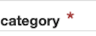
* **Adding elements** or sections can be done with the "+" button 
* **Deleting items** - if a red X 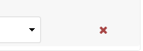 appears to the right of a line, this element may be deleted by clicking the red X
    * _Also applies to sections when allowed_
 ### Edditor Data Entry   
Multiple entry types exist in the editor. These include:
* **Text entry** - single line free text entry 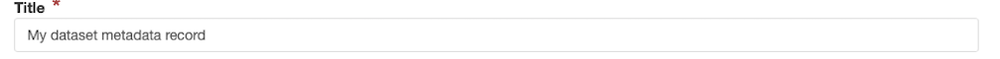
* **Text box** - expandable box for multiline text entry. Can be expanded. 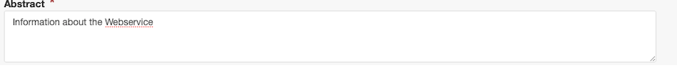
* **Recomendations text field** - Free text with suggested entry values from codelistv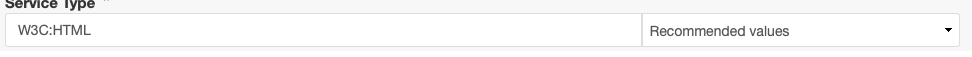
* **Dropdown selector** - to choose a single item from a enumeration or codelist
* **Mutiselector** - to choose a mutilple items from a enumeration or codelist 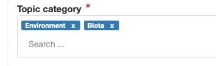
   **Date selector** - to choose dates and times. Appearance may vary depending on your browser. 

### Custom Data Entry
A small number of customised interfaces have been provided. These are managed Help for these tools is available via the help pages.
* [**Services - Connect point**](./Service-Metadata.html#connect-point) - to add service endpoint parameters
* [**Contact selection**](./Contacts-Metadata.html#using-the-search-for-contact-tool) - Used in multiple locations to populate party information
* [**Keyword selector**](./Contacts-Metadata.md#using-the-keyword-thesaurus-tool) - For selecting keywords from controllrd vocabularies
* [**Reference System selector**](./Spatial-Metadata.html#reference-system) - Used to populated Refernce system metadata from a predefined selection
* [**Constraints selector**](./Constraints-Metadata.html#using-the-constraints-selection-tool) - Used to select and populate legal and security constraints

### Page navigation aids. 
Useful for longer more complex metadata and small screens where visibility of all elements is difficult.
* 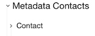 Collapsing and expanding sections is accomplished by clicking the caret at the left of the section name. 
*  Located in the upper left is a double caret in a blue circle. Clicking this collapses and expands all sections on a page.
*  The single caret in the blue circle on the lower left brings you to the top of the page.
*  Also on the lower left is a hamburger menu button in a blue circle. This exposes or hides the sidebar navigator. This consists of a list of all expandable sections in a page. Clicking a section in this sidebar takes one to that section. !{Navigation sidebar](./images/navMenu.png}

